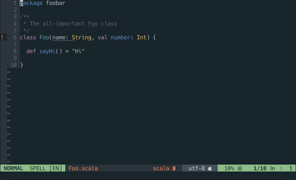

# neovim-scalavista



A Neovim plugin that provides basic IDE-like functionality for the Scala language (2.11 and 2.12):

* Show type under cursor (`:ScalavistaType`);
* Jump to definition (`:ScalavistaGoto` - does not currently work for external dependencies);
* Show Scaladoc (`:ScalavistaDoc`);
* Auto-completion (via omni completion - `i_CTRL-X_CTRL-O`);
* Linting (compiler errors/warnings show up as you type).

scalavista is not as feature-complete as [ENSIME](https://github.com/ensime) but instead aims 
to be minimalistic and lightweight. (In particular, it does not work for Java sources.)

The Neovim plugin is a front-end to the [scalavista-server](https://github.com/buntec/scalavista-server) language-server, 
which in turn is a thin wrapper around Scala's presentation compiler.


## Prerequisites

* Neovim with Python3 support and the `pynvim` package installed (`pip3 install pynvim`);
* [scalavista-server](https://github.com/buntec/scalavista-server);
* sbt and the [sbt-scalavista](https://github.com/buntec/sbt-scalavista) plugin are recommended.


## Install

Using [vim-plug](https://github.com/junegunn/vim-plug):

```
Plug 'buntec/neovim-scalavista', { 'do': ':UpdateRemotePlugins' }
```


## Usage

See [scalavista-server](https://github.com/buntec/scalavista-server) on how to install and launch scalavista-server.
Once a server is running, Neovim will connect to it upon opening any Scala source file.


## Disclaimer

This project is in alpha stage and should be considered unstable. 
